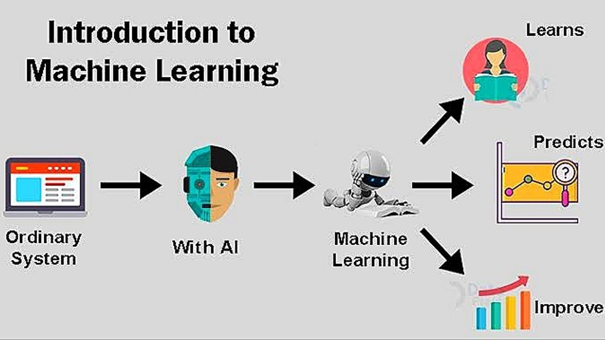

# AI Project: Regression Model for Predicting PPV
Upon reviewing the problem statement, we have outlined a structured approach to develop and evaluate a machine learning model aimed at predicting the Perceived Purchase Value (PPV) based on key features. This project will utilize regression techniques to predict PPV, and the model’s performance will be measured using established evaluation metrics.

## Table of Contents

1. [Introduction](#introduction-🤖) 🤖
2. [Project Overview](#project-overview-🌟🌟🌟) 🌟
   - [Problem Type](#🧐problem-type)
   - [Objective](#🎯objective)
   - [Models Explored](#models-explored🔍)
   - [Evaluation Metrics](#evaluation-metrics📊)
3. [Steps Involved](#steps-involved-👇) 🚀
   - [Step 1: Problem Understanding](#step-1-problem-understanding🤔)
   - [Step 2: Data Understanding](#step-2-data-understanding✍️)
   - [Step 3: Data Preprocessing](#step-3-data-preprocessing-and-preparation⚙️)
   - [Step 4: Model Selection](#step-4-model-selection-💭)
   - [Step 5: Model Training](#step-5-model-training📈)
   - [Step 6: Model Comparison and Conclusion](#step-6-model-comparison-and-conclusion-📊✅)
4. [Project Structure](#project-structure-🗂️) 🗂️
5. [Requirements](#requirements-🛠️) 🛠️
6. [Running the Project](#running-the-project-🚀) 🚀
7. [Conclusion](#conclusion-🏆) 🏆


## Introduction 🤖 

This project is focused on building a machine learning model capable of predicting the **PPV (Perceived Purchase Value)** based on features like **Gender**, **Age**, and **Duration (Dur)**. PPV is a continuous variable that reflects the value assigned by customers to a product based on their purchasing experience and behaviors.The project will evaluate the model using performance metrics like **Root Mean Squared Error (RMSE)** and **Mean Absolute Error (MAE)**.


To solve this problem, We will apply machine learning techniques, specifically regression models, to predict the target variable. 



By the end of this project, we aim to identify the best-performing model for PPV prediction, leveraging both traditional and advanced machine learning techniques.


## Project Overview 🌟🌟🌟 

### 🧐Problem Type

This is a **regression** problem where we predict the **Perceived Purchase Value (PPV)**, a continuous variable, based on features such as **Gender**, **Age**, and **Duration (Dur)**.

### 🎯Objective 

The goal is to build a machine learning model that accurately predicts PPV. We will explore various models, including **XGBoost**, **LightGBM**, and **Convolutional Neural Networks (CNNs)**, and evaluate their performance using **Root Mean Squared Error (RMSE)** and **Mean Absolute Error (MAE)**.

### Models Explored🔍

We will explore the following models:
- **XGBoost**: A powerful gradient boosting algorithm.
- **LightGBM**: A faster gradient boosting framework.
- **CNNs**: Convolutional Neural Networks for structured data.

### Evaluation Metrics📊

Model performance will be assessed using:
- **Root Mean Squared Error (RMSE)**
- **Mean Absolute Error (MAE)**

These metrics will help determine the best-performing model for predicting PPV.


## Steps Involved 👇
we will apply appropriate machine learning techniques and models specifically designed for regression tasks.

<a href="#step-1-problem-understanding🤔" style="padding:5px; ">**Problem Understanding**</a>→
<a href="#step-2-data-understanding✍️" style="padding:5px; ">**Data Understanding**</a>→
<a href="#step-3-data-preprocessing-and-preparation⚙️" style="padding:5px;"> **Data Preprocessing / Preparation**</a>→
<a href="#step-4-model-selection-💭" style="padding:5px;"> **Model Selection**</a>→
<a href="#step-5-model-training📈" style="padding:5px;"> **Model Training**</a>→
<a href="#step-6-model-comparison-and-conclusion-📊✅" style=" padding:5px;"> **Model Comparison and Conclusion**</a>

## Step 1: Problem Understanding🤔

- **Task Nature**: The task is a regression problem where the target variable (PPV) is continuous. The objective is to create a model that accurately predicts PPV, minimizing prediction errors.

- **Outcome**: The goal is to train and evaluate a regression model, using performance metrics such as RMSE and MAE.
  

## Step 2: Data Understanding✍️

Data Understanding is a critical phase in any data science or machine learning project. It involves gaining insights into the dataset that will be used to train models. This phase focuses on understanding the structure, quality, and nuances of the data before performing any analysis or model building.

## 💁 input the dataset and convert it to a dataframe to:

### 1. Understand the Nature of the Data and Structure🧩
We will begin by loading the dataset into a dataframe and inspecting the first few rows to understand the overall structure. This includes checking the columns, their data types, and reviewing initial statistics to understand the general distribution.

### 2. Examine for Missing Data 🔍
To determine if any features contain missing or empty values that require imputation or removal. 

### 3. Examine Data Types 🏷️
Ensure that categorical features are correctly identified and coded. 

### 4. Descriptive Statistics 📊
We will calculate basic statistics such as:
- Mean
- Median
- Standard Deviation
- Min and Max

This will give us an understanding of the distribution and spread of the data, especially for numerical columns like age, duration, and PPV.

### 5. Detect Outliers 🚨 
We will examine numerical features for any extreme values that might distort predictions. Outliers can be detected using visualization techniques (e.g., box plots) or statistical methods (e.g., Z-scores).

### 6. Correlation Analysis 🔗
We will Measure the relationships between features and the target variable (PPV) to assess the fit of the features. 


## 💁‍♂️ Data Inspection Results

After loading the dataset and performing a thorough analysis, we obtained the following insights:

### 1. Dataset Columns:
- **Gender**: Categorical - Represents the gender of individuals.
- **Age**: Numeric - Represents the age of individuals.
- **Duration**: Numeric - Represents a duration-like value.
- **PPV**: Numeric - The target variable we aim to predict.

### 2. Missing Values:
- There are no missing values in the dataset. All columns are completely filled.

### 3. Data Types:
- **Gender**: Categorical (Object)
- **Age**: Numeric (int64)
- **Duration**: Numeric (int64)
- **PPV**: Numeric (float64) (Target Variable)

### 4. Descriptive Statistics:
- **Age**: Ranges from 0 to 80 years, with a mean of 31.3 years.
- **Duration**: Ranges from 1 to 50, with a mean of 22.88.
- **PPV (Target Variable)**: Ranges from 1.0 to 26.02, with a mean of 14.86.

### 5. Correlation Analysis:
- **PPV and Duration**: Strong positive correlation (**0.978**), indicating that Duration is a major predictor of PPV.
- **PPV and Age**: Moderate negative correlation (**-0.565**), indicating an inverse relationship.
- **Age and Duration**: Moderate negative correlation (**-0.507**), indicating some dependency between Age and Duration.

### Insights 🧑‍🏫:
- The dataset is clean, with no missing values or obvious issues.
- **Duration** (Dur) is highly correlated with **PPV**, making it the most significant predictor in the model.
- **Age** shows a moderately negative correlation with **PPV**, suggesting that it should still be included as a feature, despite the inverse relationship.

## Step 3: Data Preprocessing and Preparation⚙️

In this step, we will transform the dataset into a form suitable for training machine learning models:

1. **Encoding Categorical Features**:
   - The **Gender** column is categorical and needs to be converted into numerical values. We will use **label encoding** to convert `Male` to `0` and `Female` to `1`.

2. **Scaling Numerical Features**:
   - We will standardize the **Age** and **Duration** columns using **StandardScaler** or **MinMaxScaler** to ensure all features contribute equally to the model.

3. **Splitting Data**:
   - The dataset will be divided into **training** and **testing** sets (e.g., 80% for training, 20% for testing) to evaluate the model’s performance.

4. **Handling Outliers**:
   - Outliers in numerical features (**Age**, **Duration**, **PPV**) will be detected and handled using **winsorization** or **removal**, if necessary, to avoid skewing the model.

5. **Feature Selection**:
   - Based on the correlation analysis and domain knowledge, we will retain all available features (**Gender**, **Age**, **Duration**) for model training.

6. **Prepare for Modeling**:
   - Ensure the target variable (**PPV**) is separate and correctly aligned with the features for training.

 ⏳ Once the preprocessing steps are completed, we will display the prepared dataset.


## Step 4: Model Selection 💭

This step involves choosing the appropriate machine learning algorithm(s) to predict the target variable (**PPV**) based on the given features.

### 💁 Candidate Models:
Given that this is a regression task, we have identified the following machine learning models:

1. **XGBoost (Extreme Gradient Boosting)**:
   - Known for its speed and performance on tabular data.
   - Handles missing values well and supports feature importance analysis.
   - **Justification**: Suitable for high-dimensional data and often achieves state-of-the-art results.

2. **LightGBM (Light Gradient Boosting Machine)**:
   - Efficient for large datasets with many features.
   - Handles categorical data natively and offers faster training than XGBoost in many cases.
   - **Justification**: Can handle imbalanced and sparse data effectively.

3. **Convolutional Neural Networks (CNNs)**:
   - Primarily used for image data but can be adapted for structured data.
   - **Justification**: Although CNNs may not be the most natural choice for this regression task, they could be explored for comparative purposes.

### 💁‍♂️ Selection Justification:
For this task, **XGBoost** is likely the best choice due to:
- Its ability to handle mixed data types (categorical and numeric).
- Robust performance on tabular datasets.
- Flexibility in fine-tuning hyperparameters for optimal results.

### 💁‍♀️ Model Evaluation:
- We will evaluate the model's performance using **Root Mean Squared Error (RMSE)** and **Mean Absolute Error (MAE)** on both the training and test datasets.
- Hyperparameter tuning will be performed (e.g., grid search or random search) to improve the model’s performance.

---

## Step 5: Model Training📈

This step involves training the selected model(s) on the preprocessed data and tuning it to achieve optimal performance.

### 1. **Training the XGBoost Model**:
   - We will train the **XGBoost** model using the preprocessed training dataset.
   - **Features**: Gender, Age, Duration
   - **Target**: PPV
   - Initially, we will train the model using default hyperparameters, followed by hyperparameter tuning if necessary.

### 2. **Steps to Train the Model**:
   1. **Import XGBoost**: Use the `XGBRegressor` from the XGBoost library.
   2. **Initialize the Model**: Set default hyperparameters (learning rate, max depth, number of estimators, etc.).
   3. **Train the Model**: Fit the training data (`X_train`, `y_train`) to the model.
   4. **Evaluate Performance**: Validate the model on the test dataset (`X_test`, `y_test`) using RMSE and MAE.
   5. **Hyperparameter Tuning** (if needed): Use techniques like Grid Search or Random Search to optimize model performance.

### 3. **Expected Output**:
   - The output will include the **RMSE** and **MAE** values, which will assess the model’s predictive accuracy on the test dataset.

## Step 6: Model Comparison and Conclusion 📊✅  

In this step, we compare the performance of the model trained during the project. The comparison is based on key evaluation metrics, such as **Root Mean Squared Error (RMSE)** and **Mean Absolute Error (MAE)**, to determine which model provides the most accurate predictions.

### 💁 Process of Comparison:

1. **Metric Analysis**:
   - Evaluate RMSE and MAE for each model.
   - Lower values for these metrics indicate better predictive performance.

2. **Model Insights**:
   - Analyze the strengths and weaknesses of each model based on their predictions.
   - Consider overfitting, underfitting, and computational efficiency.

3. **Visualization**:
   - Use comparison plots (e.g., bar charts or line graphs) to visually interpret the performance differences.

### 💁‍♂️ Conclusion:
Based on the comparison, we select the model that demonstrates the best balance between predictive accuracy and computational efficiency. The final selected model will be used for generating predictions and real-world implementation.


---

## **Project Structure** 🗂️

```
AIProject/
├── data/                           # Stores raw and processed datasets
│   ├── dataset.xlsx                # Original dataset file
│   ├── preprocessed_data.csv       # Preprocessed dataset after cleaning will contain all the data (features + target).
│   ├── features.csv                # will contain only the feature columns (Gender, Age, Dur).
│   ├── target.csv                  # will contain the target variable (PPV).
├── notebooks/                      # Jupyter notebooks for Step 2: Data Understanding
│   └── DataUnderstanding.ipynb     # Notebook for Data Understanding
├── scripts/                        # Python scripts for modular tasks
│   ├── process.ipynb               # Step 3: Data Preprocessing and Preparation
│   ├── train_xgboost.ipynb         # XGBoost training script
│   ├── train_lightgbm.py           # LightGBM training script (optional)
│   ├── train_cnn.py                # CNN training script (optional)
├── models/                         # Stores trained models
│   └── saved_model_xgboost.pkl     # Serialized XGBoost model
├── results/                        # Outputs like reports and visualizations
│   ├── evaluation_report.txt       # Model evaluation results (e.g., RMSE/MAE)
│   └── visualizations/             # Plots and charts from analysis
│       ├── feature_distributions.png
│       ├── correlation_matrix.png
│       └── model_predictions.png
├── README.md                       # Project overview and instructions
├── requirements.txt                # Python dependencies
└── main.py                         # Pipeline script to run preprocessing, training, and evaluation
```
## Requirements 🛠️  

To successfully run the project, ensure you have the following dependencies installed:  

- **Python** 🐍 (Version 3.8 or higher)
- **Libraries** 📦:  
  - `pandas` 🧾 - For data manipulation and analysis  
  - `numpy` 🔢 - For numerical operations  
  - `scikit-learn` 🧠 - For machine learning tasks  
  - `xgboost` 🚀 - For building XGBoost models  
  - `lightgbm` 💡 - For building LightGBM models  
  - `tensorflow/keras` 🧬 - For creating CNNs (optional)  
  - `matplotlib` 📊 - For plotting visualizations  
  - `seaborn` - For statistical data visualization  

### Installation Steps ⚙️  

1. Clone the repository:  
   ```
   git clone <repository_url>
   cd project_name

Install the dependencies by running:

```
pip install -r requirements.txt

```
## Running the Project 🚀

### 1. Preprocess the Data 🧹  
Run the script to clean and prepare the data:  
```
python scripts/preprocess.py
```
### 2. Train the Model 🤖
Run the script to train the XGBoost model on the data:
```
python scripts/train_xgboost.py
```
To train other models (optional), you can run:

```
python scripts/train_lightgbm.py   # For LightGBM model
python scripts/train_cnn.py        # For CNN model
```
### 3. Evaluate the Model 📊
Run the script to evaluate the model's performance using RMSE and MAE:
```
python scripts/evaluate_model.py
```
### 4. Visualize Results 📈
Visualizations such as feature importance and model predictions will be saved in the following directory:

```
results/visualizations/
```
This directory will contain files such as:

feature_distributions.png
correlation_matrix.png
model_predictions.png

### 5. Run the Main Pipeline Script 🏃‍♂️
You can also run the main pipeline script that executes the entire process from preprocessing, training, and evaluation:

```
python main.py
```

This structure will guide users to run the project step by step, providing the necessary scripts and details for each stage of the project.


## Conclusion 🏆

This project aims to predict the target variable **PPV (Perceived Purchase Value)** using a regression model. We explored several machine learning techniques, including **XGBoost**, **LightGBM**, and **CNN**, to ensure robust prediction and analysis of the dataset. 

The model's performance was evaluated using key metrics such as **Root Mean Squared Error (RMSE)** and **Mean Absolute Error (MAE)**. Through fine-tuning and optimization, we aimed to achieve the best possible results.

By the end of this project, the trained model will provide meaningful insights and predictions based on the given features, helping to better understand customer behavior, enhance personalization, and optimize business decisions.

This project not only demonstrates the predictive capabilities of various models but also provides valuable insights into how **Duration** and **Age** influence **PPV**. The insights gained can be used to improve decision-making and refine marketing strategies.


